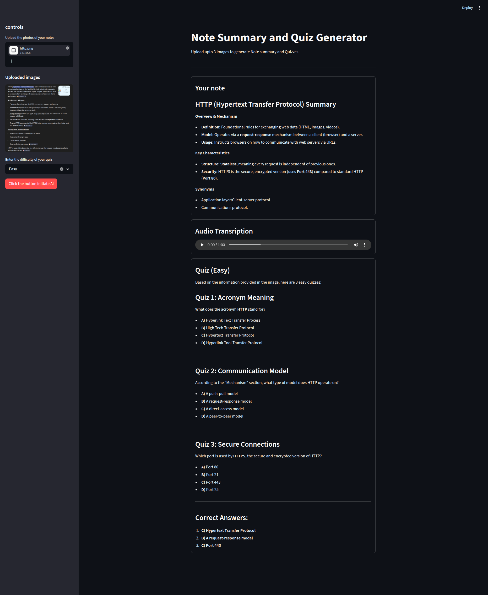

## Image to Note/Audio Transcription/Quiz generator
---------------------------------------------------

project is made with python/google-genai and gemini library and in the UI made with streamlit




# Project setup
```
# create a virtual env
python3 -m venv env
source env/bin/activate

pip install -r requirements.txt

streamlit run app.py


```